#  MCP Server - Spring Boot + AI Tooling

Ce projet est une application Java basée sur Spring Boot qui expose des outils dynamiques pour simuler des informations financières sur des entreprises marocaines.  
Grâce aux annotations `@Tool` de `spring-ai`, les méthodes de la classe `StockTools` peuvent être découvertes et utilisées dynamiquement par des systèmes d’IA ou des interfaces externes (chatbots, agents, etc.).

L'application peut être intégrée avec un client Python via API REST ou WebSocket pour former une architecture distribuée.


## Partie 1: Serveur MCP 

###  Package principal
Le code Java du serveur MCP est contenu dans le package :

```

net.fatima.mcpserver1

````

Ce serveur utilise **Spring Boot** pour démarrer automatiquement et exposer des outils métiers via `spring-ai`.

---

###  Objectif du serveur MCP

Le serveur Spring Boot expose une classe `StockTools` contenant des méthodes annotées avec `@Tool`, permettant à des agents (ex: chatbot Python, LangChain, etc.) d'appeler dynamiquement ces méthodes pour :
- Obtenir les infos d'une entreprise par son nom
- Lister toutes les entreprises disponibles
- Obtenir une valeur boursière simulée pour une entreprise

---

###  Classe principale : `McpServer1Application.java`

```java
@SpringBootApplication
public class McpServer1Application {

    public static void main(String[] args) {
        SpringApplication.run(McpServer1Application.class, args);
    }

    @Bean
    public MethodToolCallbackProvider getMethodToolCallbackProvider() {
        return MethodToolCallbackProvider.builder()
                .toolObjects(new StockTools())
                .build();
    }
}
````

Cette classe :

* Démarre le serveur
* Déclare un **bean `MethodToolCallbackProvider`** qui enregistre la classe `StockTools` comme **source d’outils dynamiques**

---

###  Classe outil : `StockTools.java`

```java
public class StockTools {

    private List<Company> companies = List.of(
        new Company("Maroc Telecom", "Telecom", 3.6, 10600, "Maroc"),
        new Company("OCP", "Extraction minière", 5.6, 20000, "Maroc")
    );

    @Tool(description = "Get a company by name")
    public Company getCompanyByName(String companyName) {
        return companies.stream()
                .filter(c -> c.name().equals(companyName))
                .findFirst()
                .orElseThrow(() -> new RuntimeException(String.format("Company %s not found", companyName)));
    }

    @Tool(description = "Get All Companies")
    public List<Company> getAllCompanies() {
        return companies;
    }

    @Tool
    public Stock getStockByCompany(String companyName) {
        return new Stock(companyName, LocalDate.now(), 100 + Math.random() * 1000);
    }
}
```

Cette classe expose 3 outils :

1. `getCompanyByName(String name)` → retourne un objet `Company`
2. `getAllCompanies()` → retourne la liste des entreprises simulées
3. `getStockByCompany(String name)` → retourne un objet `Stock` avec une valeur aléatoire

---

###  Types utilisés (`record`)

```java
record Company(
    String name,
    String activity,
    @Description("The turnover In Milliard MAD") double turnover,
    int employesCount,
    String country
) {}

record Stock(String companyName, LocalDate date, double stock) {}
```

Ces objets sont automatiquement **serialisés en JSON** lors des réponses API ou des échanges avec les clients (ex: Python ou OpenAI functions).

---

###  Comment ça fonctionne avec `spring-ai`

* Les annotations `@Tool` rendent les méthodes **découvrables dynamiquement**
* L'API peut être appelée par des outils d'IA (comme des LLMs, LangChain, ou un client Python)
* L’agent (par exemple un chatbot) peut appeler `getAllCompanies()` sans connaître le code Java
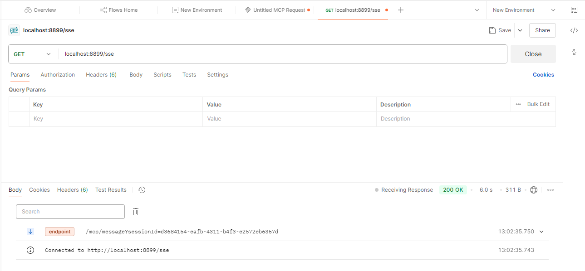

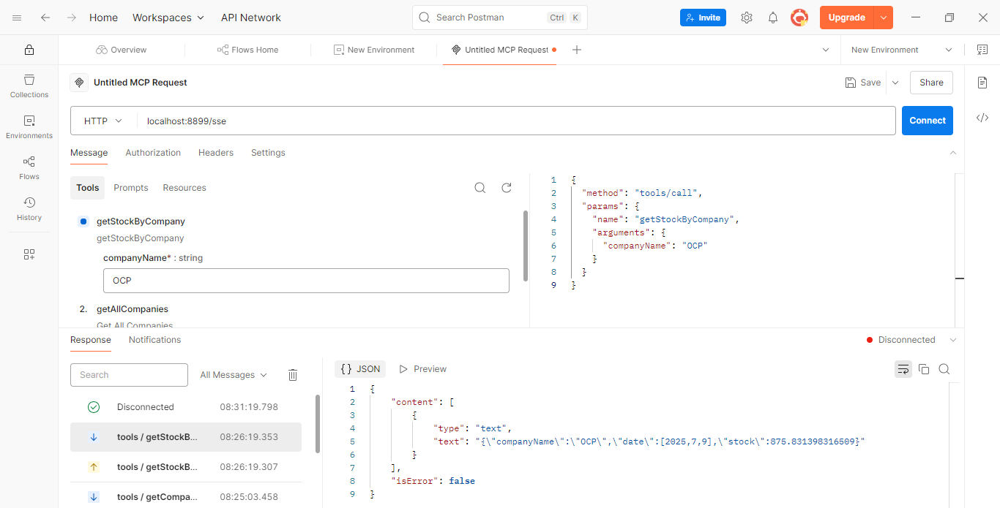
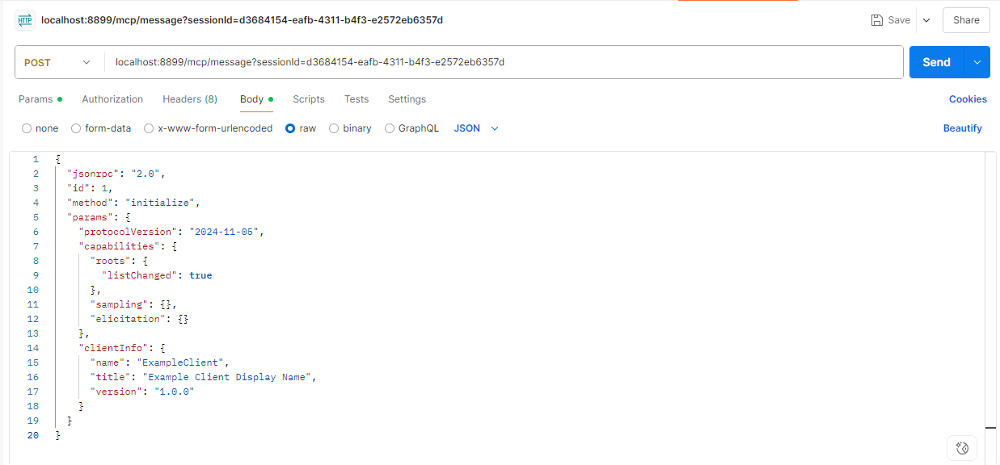
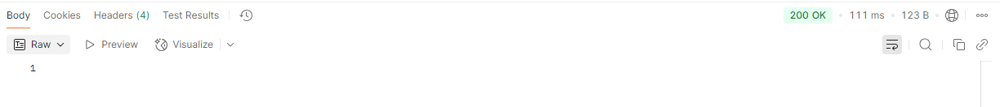
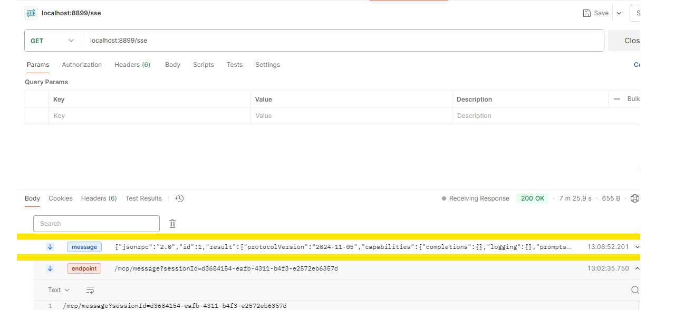
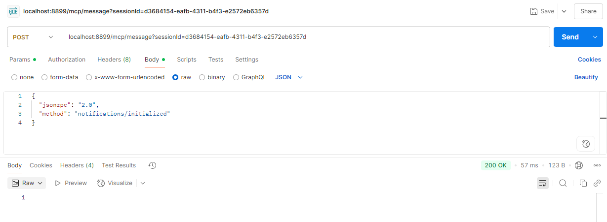
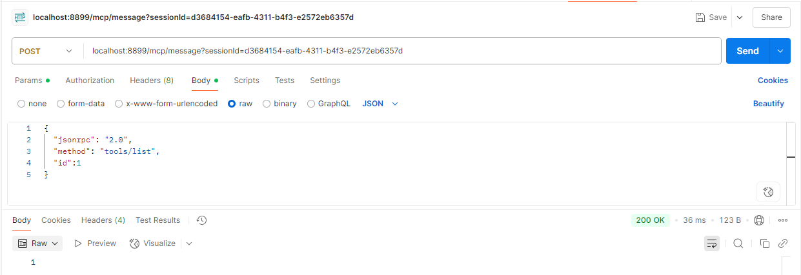
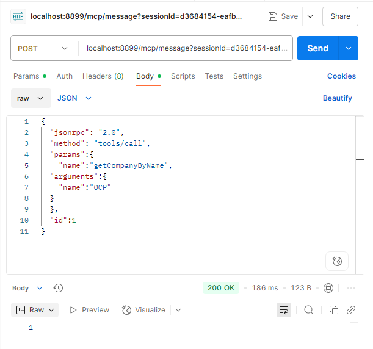
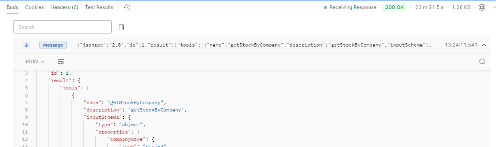


---

###  Exemple de réponse JSON

Si on appelle `getCompanyByName("OCP")`, la réponse pourrait être :

```json
{
  "name": "OCP",
  "activity": "Extraction minière",
  "turnover": 5.6,
  "employesCount": 20000,
  "country": "Maroc"
}
```


###  Avantages de cette architecture

* Facilement extensible : tu peux ajouter d'autres outils `@Tool` sans changer le client
* Interopérable : peut être appelé par Python, .NET, PHP, etc.
* Dynamique : les méthodes sont "auto-documentées" pour des agents intelligents


##  Partie 2 – Client MCP (Spring Boot) avec Agent IA

Le client MCP est une application Spring Boot qui joue le rôle **d'agent intelligent**.  
Il utilise `spring-ai` pour dialoguer avec un LLM (modèle de langage) et interagir dynamiquement avec les outils exposés par le serveur MCP.

---

###  Connexion au serveur MCP

La connexion au serveur se fait via un protocole appelé **MCP (Model Context Protocol)**, qui permet de découvrir et d'appeler dynamiquement des outils définis côté serveur.

```json
{
  "mcpServers": {
    "filesystem": {
      "command": "npx",
      "args": [
        "-y",
        "@modelcontextprotocol/server-filesystem",
        "C:\\Users\\HP\\Documents\\Master\\M2\\Systems Distribues\\TP\\PROJET\\mcp-chatbot-spring-python"
      ]
    }
  }
}
````

Cette configuration permet de lire les outils depuis le serveur local en utilisant un serveur MCP Filesystem.

---
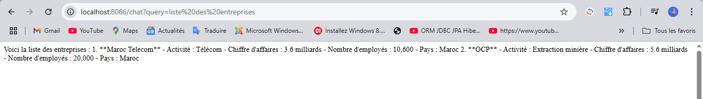
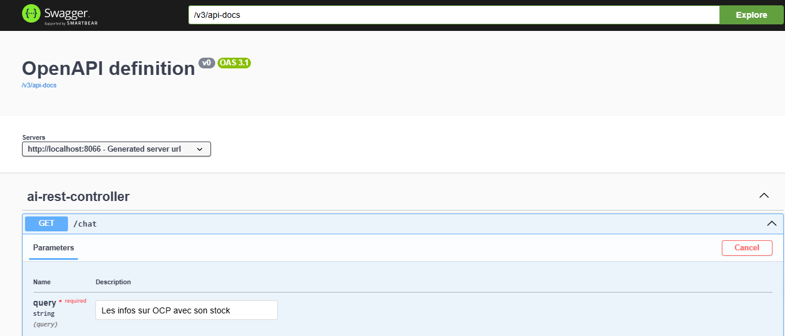
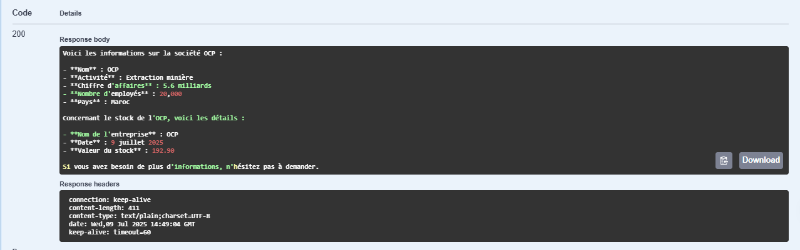


###  Classe `AIAgent.java` – Construction de l’agent intelligent

```java
@Service
public class AIAgent {
    private ChatClient chatClient;

    public AIAgent(ChatClient.Builder chatClient, ToolCallbackProvider toolCallbackProvider) {
        this.chatClient = chatClient
                .defaultSystem("Answer the user question using provided tools")
                .defaultToolCallbacks(toolCallbackProvider)
                .defaultAdvisors(MessageChatMemoryAdvisor
                        .builder(MessageWindowChatMemory.builder().build()).build())
                .build();
    }

    public String askLLM(String query) {
        return chatClient.prompt()
                .user(query)
                .call()
                .content();
    }
}
```

Cette classe utilise :

* `ChatClient` : un client IA connecté à un LLM
* `ToolCallbackProvider` : pour utiliser dynamiquement les outils MCP
* `MessageWindowChatMemory` : pour maintenir le contexte conversationnel

---

###  API REST : `AIRestController.java`

```java
@RestController
public class AIRestController {
    private AIAgent agent;

    public AIRestController(AIAgent agent) {
        this.agent = agent;
    }

    @GetMapping("/chat")
    public String chat(String query) {
        return agent.askLLM(query);
    }
}
```

L’agent peut être interrogé via une simple URL :

```
GET http://localhost:8080/chat?query=Quel est le chiffre d’affaires de Maroc Telecom ?
```

Il retournera une réponse intelligente en appelant les outils MCP du serveur.

---

### ️ `McpClientApplication.java` – Découverte & appel d’outils

```java
@Bean
CommandLineRunner run(List<McpSyncClient> clients) {
    return args -> {
        clients.forEach(client -> {
            client.listTools().tools().forEach(tool -> {
                System.out.println("***************");
                System.out.println(tool.name());
                System.out.println(tool.inputSchema());
                System.out.println(tool.description());
                System.out.println("************");
            });
        });

        var params = """
                {
                 "companyName":"OCP"
                }
                """;

        McpSchema.CallToolResult result = clients.get(0)
            .callTool(new McpSchema.CallToolRequest("getStockByCompany", params));

        System.out.println(result.content().get(0).type());
    };
}
```

Cette méthode :

* Affiche tous les outils MCP disponibles
* Appelle un outil (`getStockByCompany`) dynamiquement
* Affiche la réponse dans la console


Parfait Fatima 🌟
Tu viens de partager le code et la config pour la **partie Python** de ton projet (`python-mcp-server`) avec :

* Le script Python `server.py` qui utilise `FastMCP`
* Le fichier `pyproject.toml` avec `pdm`
* La configuration de démarrage via `uv` (et `mcp run`)

Je vais maintenant te rédiger **la Partie 3 du README.md** sous le titre :

---

##  Partie 3 – Serveur Python MCP (FastMCP)

Cette partie du projet représente le **serveur Python**, qui expose dynamiquement des outils au format MCP (Model Context Protocol).  
Il utilise la librairie `FastMCP` et peut être exécuté via `uv` + `pdm`.

---

###  Arborescence minimale du projet Python

```

python-mcp-server/
├── server.py
├── **init**.py
└──  pyproject.toml

````

---

###  Script `server.py` – Définition d’un outil Python

```python
from mcp.server.fastmcp import FastMCP

mcp = FastMCP('Python-MCP-Server')

@mcp.tool()
def get_employee_info(name: str) -> str:
    return {
        "employee_name": name,
        "salary": 5400,
    }
````

Cette fonction sera exposée comme **outil dynamique** compatible MCP. Elle peut être appelée par n’importe quel client MCP (Java, Python, etc.).

---

###  Fichier `pyproject.toml` (PDM)

```toml
[project]
name = "fatima"
version = "0.1.0"
description = "Default template for PDM package"
authors = [
    {name = "FATIMA AIT LAMINE", email = "fatima.aitlamine03@gmail.com"},
]
dependencies = [
    "requests>=2.32.4",
    "flask>=3.1.1",
    "openai>=1.95.0",
    "mcp[cli]>=1.11.0"
]
requires-python = ">=3.13"
readme = "README.md"
license = {text = "MIT"}

[build-system]
requires = ["pdm-backend"]
build-backend = "pdm.backend"

[tool.pdm]
distribution = true
```

> Ce fichier gère les dépendances du projet avec [PDM](https://pdm.fming.dev), un gestionnaire de paquets moderne pour Python.

---

###  Démarrage du serveur MCP (Python)

Tu peux démarrer ton serveur MCP via :

```bash
uv run --with mcp[cli] mcp run python-mcp-server/server.py
```

Ou bien (si défini dans ton `mcpServers`):

```json
"Python_MCP_Server": {
  "command": "uv",
  "args": [
    "run",
    "--with",
    "mcp[cli]",
    "mcp",
    "run",
    "C:\\Users\\HP\\Documents\\Master\\M2\\Systems Distribues\\TP\\PROJET\\mcp-chatbot-spring-python\\python-mcp-server\\server.py"
  ]
}
```

Cela permet de lancer dynamiquement ton outil Python en tant que **serveur MCP**, consommable par ton client Java (ou autre).

